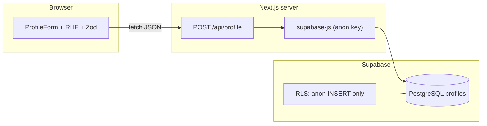

# Career Profile Intake

A [Next.js](https://nextjs.org) app for collecting career profiles: a multi-section form with completeness tracking, validation, and persistence in [Supabase](https://supabase.com) (PostgreSQL).

---

## Architecture

### High level

- **Browser (client)** — The home page is a client component that renders the intake form (`ProfileForm`), a `CompletenessMeter`, and save/confirmation modals. State is managed with **React Hook Form**; **Zod** validates the same shape on the client and server.
- **Next.js App Router** — UI lives under `app/`. The app **does not** call Supabase from the browser. The client submits JSON to a **Route Handler** at `POST /api/profile`.
- **API route** — `app/api/profile/route.ts` parses the body with `profileSchema`, maps fields to the `profiles` table, and inserts using the Supabase **anon** key on the server (`createSupabaseServerClient` in `app/lib/supabase.ts`). Duplicate emails are rejected (unique index on `lower(trim(email))`).
- **Supabase** — **PostgreSQL** stores rows in `public.profiles`. **Row Level Security** is enabled; a policy allows **anonymous inserts only** (no public `SELECT` for anon), matching the “public form, HR-only data access” model.



### Project layout (concise)

| Area | Role |
|------|------|
| `app/page.tsx` | Intake page: form wiring, save flow, completeness |
| `app/components/` | `ProfileForm`, `CompletenessMeter`, `SaveProfileModals`, etc. |
| `app/lib/profileSchema.ts` | Zod schema shared with the API |
| `app/lib/completeness.ts` | Completeness scoring for the meter |
| `app/api/profile/route.ts` | Validates and inserts into Supabase |
| `app/lib/supabase.ts` | Server Supabase client (`NEXT_PUBLIC_*` URL + anon key) |
| `supabase/migrations/*.sql` | Schema + policies to apply in your Supabase project |

---

## Prerequisites

- **Node.js** 20+ (matches `package.json` / TypeScript tooling)
- **npm** (or use `pnpm` / `yarn` / `bun` with equivalent commands)
- A **Supabase** account (free tier is enough for personal projects)

---

## 1. Set up your personal Supabase project

These steps use Supabase **hosted** (recommended). You get a dedicated Postgres instance, auth dashboard, and API keys without running Docker locally.

### 1.1 Create a project

1. Go to [https://supabase.com](https://supabase.com) and sign in.
2. **New project** → choose organization, **name**, **database password** (save it), and **region** close to you.
3. Wait until the project finishes provisioning.

### 1.2 Get API credentials for the app

1. Open your project → **Project Settings** (gear) → **API**.
2. Copy:
   - **Project URL** → this is `NEXT_PUBLIC_SUPABASE_URL`.
   - **Project API keys** → **anon** `public` key → this is `NEXT_PUBLIC_SUPABASE_ANON_KEY`.  
   Use the **anon** key in this app (the server route uses it with RLS; do not expose the **service_role** key in frontend or public env).

### 1.3 Apply the database schema

The SQL lives in `supabase/migrations/` and must run **in order**:

1. `20260402000000_create_profiles.sql` — creates `profiles`, indexes, RLS, and `anon` insert policy.
2. `20260402000001_profiles_email_unique.sql` — unique constraint on normalized email.

**Option A — SQL Editor (simplest)**

1. In Supabase: **SQL Editor** → **New query**.
2. Paste the full contents of `20260402000000_create_profiles.sql`, run it.
3. New query → paste `20260402000001_profiles_email_unique.sql`, run it.

**Option B — Supabase CLI**

If you use the [Supabase CLI](https://supabase.com/docs/guides/cli) linked to this project, you can push migrations from your machine; the repo currently ships migration files without a checked-in `config.toml`, so Option A is the default path.

After this, the `profiles` table exists and anonymous clients can **insert** rows (as used by the Next.js API route).

---

## 2. Run the app locally

### 2.1 Install dependencies

From the repository root:

```bash
npm install
```

### 2.2 Environment variables

Create a file named **`.env.local`** in the project root (Next.js loads it automatically in development). Add:

```bash
NEXT_PUBLIC_SUPABASE_URL=https://YOUR_PROJECT_REF.supabase.co
NEXT_PUBLIC_SUPABASE_ANON_KEY=your_anon_public_key_here
```

Replace the values with those from **Project Settings → API** (see §1.2).

> **Note:** The `NEXT_PUBLIC_` prefix is required for Next.js to expose these to the server bundle; the client only talks to `/api/profile`, but the server module that creates the Supabase client reads these variables.

### 2.3 Start the dev server

```bash
npm run dev
```

Open [http://localhost:3000](http://localhost:3000). Submitting the form should create a row in **Table Editor → `profiles`** in Supabase.

### 2.4 Other scripts

| Command | Purpose |
|---------|---------|
| `npm run build` | Production build |
| `npm run start` | Run production server (after `build`) |
| `npm run lint` | ESLint |

---

## Troubleshooting

- **“Missing NEXT_PUBLIC_SUPABASE_URL or NEXT_PUBLIC_SUPABASE_ANON_KEY”** — `.env.local` is missing, misnamed, or the dev server was started before the file existed; restart `npm run dev`.
- **500 on save / “Server configuration error”** — Wrong URL/key, or migrations not applied (table or policy missing).
- **409 / duplicate email** — Expected: the same email cannot be submitted twice (unique index).

---

## Deploy

You can deploy the Next.js app to [Vercel](https://vercel.com) or any host that supports Node. Set the same two environment variables in the host’s project settings (no service role key required for this app’s current design).
